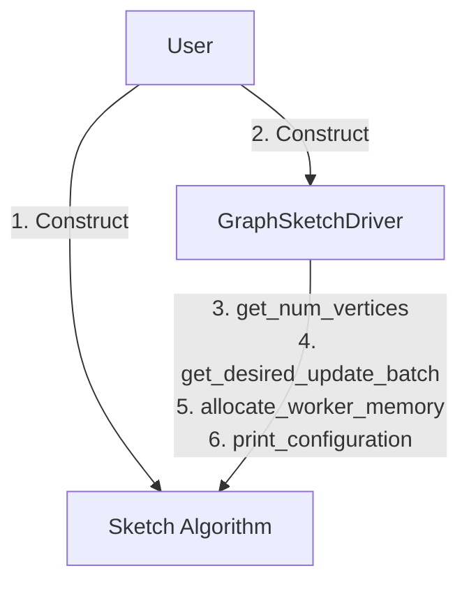
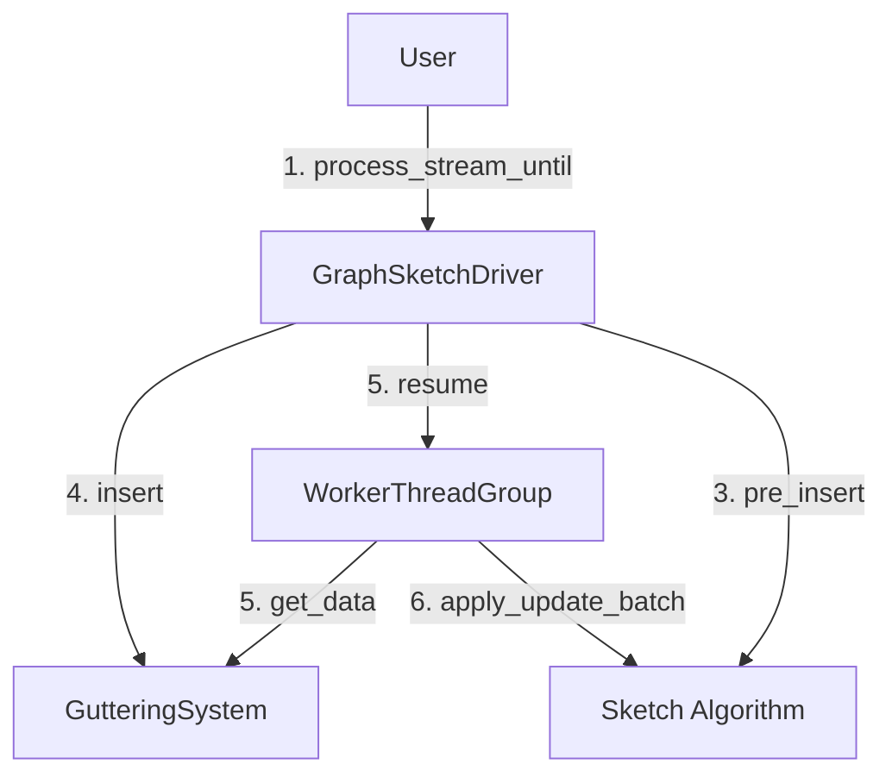
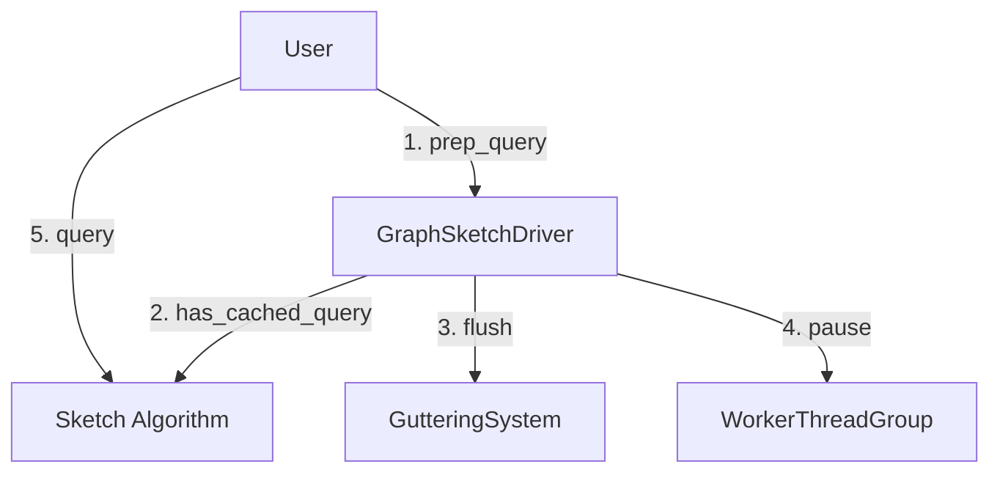

# GraphZeppelin Control Flow
These charts describe how our basic operations are performed in GraphZeppelin.

## Driver Level Flow
---

### Initialization

### Stream Processing

### Preforming a Query

