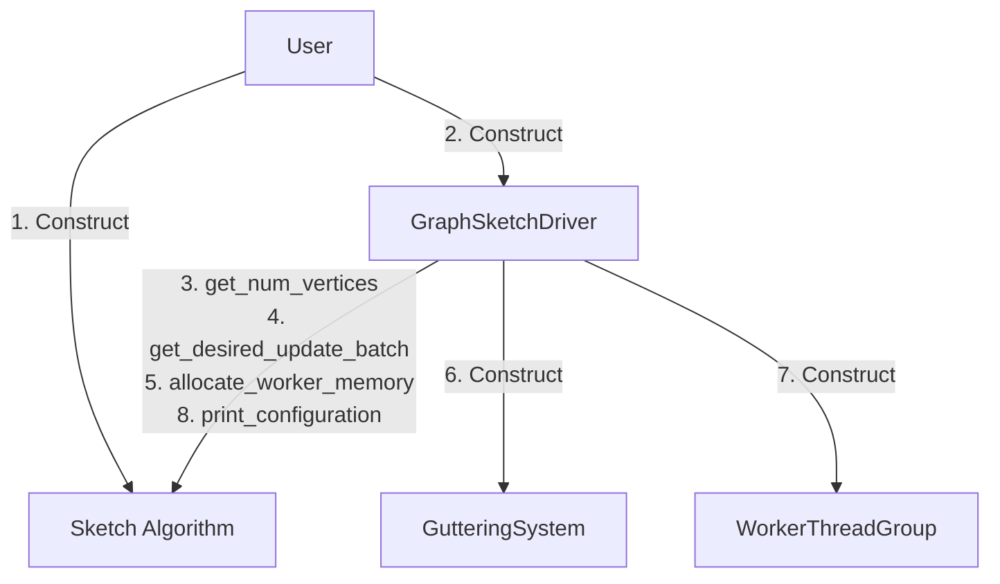
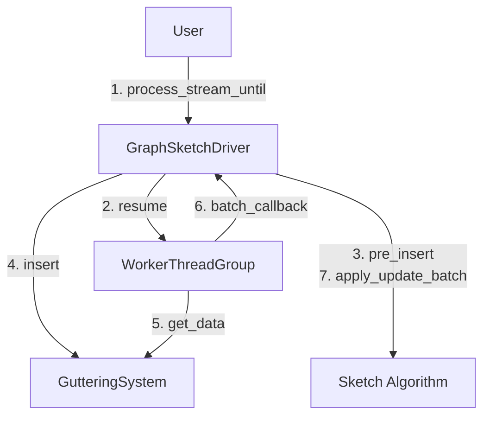
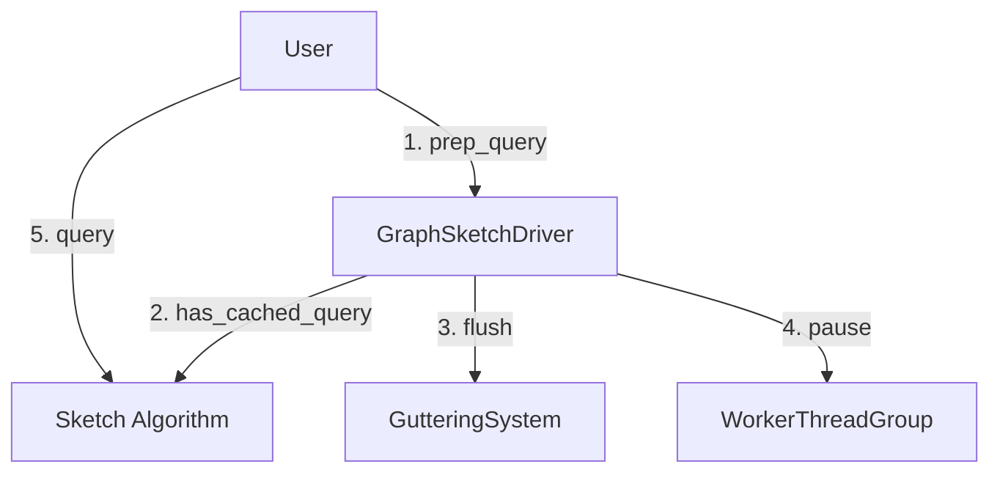

# GraphZeppelin Control Flow
These charts describe how our basic operations are performed in GraphZeppelin.

## Driver Level Flow

### Initialization
The driver pulls information from the graph sketch algorithm and tells the algorithm to allocate scratch space for its threads to use.

### Stream Processing
When processing a stream, the driver coordinates its own threads, the `GutteringSystem` which batches updates, the `WorkerThreadGroup` which applies sketch updates, and the graph sketch algorithm. Once the setup steps 1-2 complete, for each stream update until the breakpoint (either query or end of stream) we perform steps 3-7.

### Preforming a Query
To perform a query, the user must first call `driver.prep_query()` in which the driver ensures the query is safe to perform. Specifically, the driver must ensure that all stream updates have been processed before allowing the query to continue. If step 2 `has_cached_query()` returns true, the driver can safely skip steps 3-4 and immediately allow the user to perform the query.

