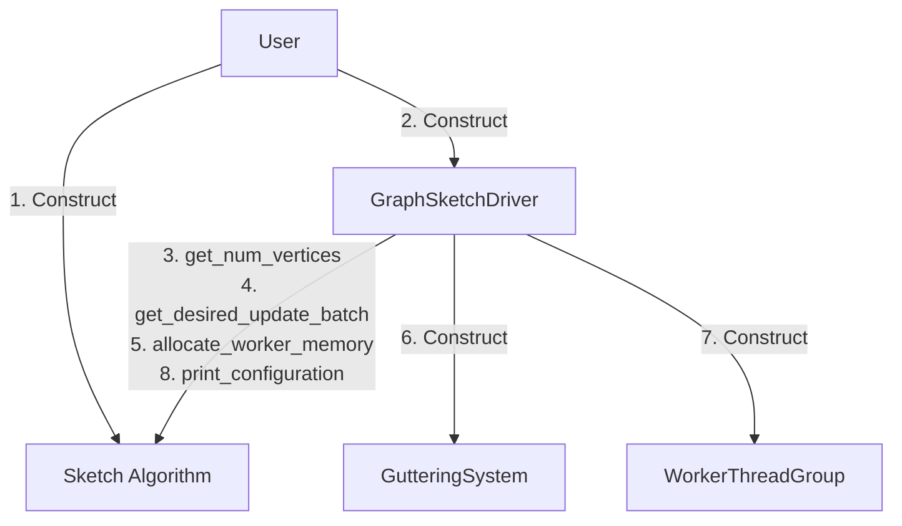
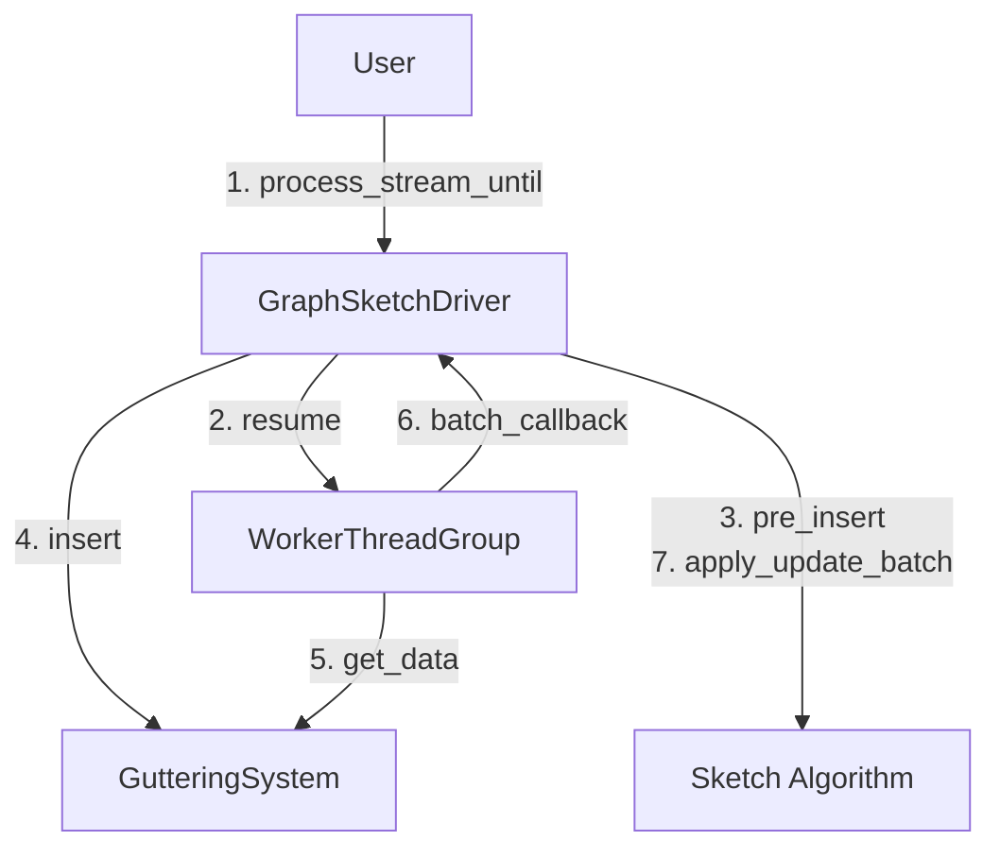
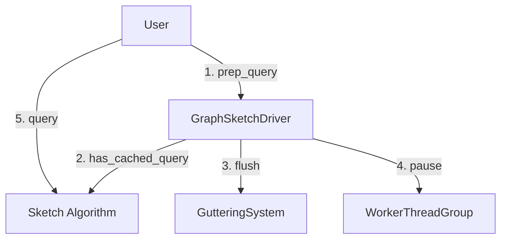

# GraphZeppelin Control Flow
In this file we document how the GraphZeppelin control works using flowcharts and step by step descriptions. In our flow chart we connect objects `A` and `B` with a directed edge `A --> B` that indicates object `A` calling a method of object `B`.

## Driver Level Flow
The driver is responsible for managing and coordinating the CPU `WorkerThreadGroup`, the `GutteringSystem`, and the `SketchAlgorithm`. The driver can do this for any vertex based sketch algorithm (which the driver is templatized upon) so long as the algorithm implements the required functions.

### Initialization
Steps to initialize the sketch algorith and driver.
  1. User constructs the `SketchAlgorithm`.
  2. User constructs the `GraphSketchDriver`.
  3. `GraphSketchDriver` pulls `num_vertices` from algorithm.
  4. `GraphSketchDriver` requests the desired batch size from the algorithm.
  5. `GraphSketchDriver` tells the algorithm to allocate space for its worker threads.
  6. `GraphSketchDriver` constructs `GutteringSystem`.
  7. `GraphSketchDriver` constructs `WorkerThreadGroup`.

### Stream Processing
When processing a stream, the driver coordinates its own threads, the `GutteringSystem` which batches updates, the `WorkerThreadGroup` which applies sketch updates, and application of updates to the graph sketch algorithm. Once the setup steps 1-2 complete, for each stream update until the breakpoint (either query or end of stream) we perform steps 3-7.
  1. User tells the driver to read stream until a query breakpoint or end of stream.
  2. `GraphSketchDriver` resumes its CPU worker threads (may have been paused by a query).
  3. When processing an update `GraphSketchDriver` first calls the algorithm's `pre_insert` function to allow the algorithm to do per update work before the updates are batched. Maintaining a cached query result for Connected Components is an example of why we allow this option.
  4. `GraphSketchDriver` inserts the update into the `GutteringSystem`.
  5. `WorkerThreadGroup` pulls a batch of updates from the `GutteringSystem`.
  6. `WorkerThreadGroup` does not know what sketch algorithm we are running so calls `GraphSketchDriver`'s `batch_callback` function.
  7. `GraphSketchDriver` calls the algorithm's `apply_update_batch()` function.

### Preforming a Query
To perform a query, the user must first call `driver.prep_query()` in which the driver ensures the query is safe to perform. Specifically, the driver must ensure that all stream updates have been processed before allowing the query to continue. If step 2 `has_cached_query()` returns true, the driver can safely skip steps 3-4 and immediately allow the user to perform the query.
  1. User wants to preform a query so calls `prep_query`.
  2. `GraphSketchDriver` checks if the algorithm has a valid cached query answer. In this case it can immediately return control to the user.
  3. `GraphSketchDriver` flushes the `GutteringSystem` of all updates.
  4. `GraphSketchDriver` calls `pause` to wait for the `WorkerThreadGroup` to finish applying all updates.
  5. The user preforms the desired query. For example `connected_components()`.

